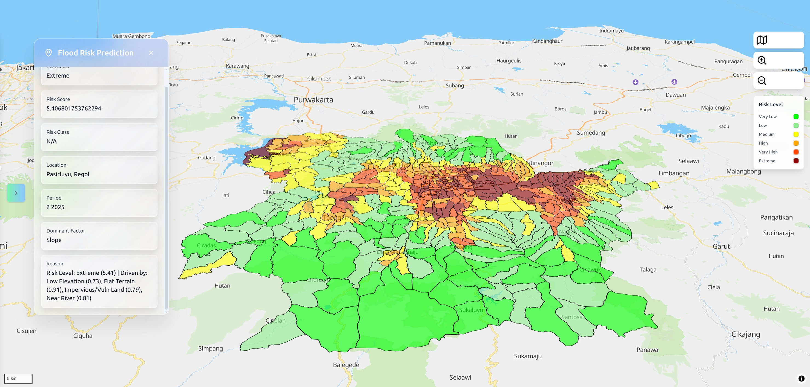

# Murasa

Warning!! This is still in early development stage. I'm currently making this more agnostic. It was specifically made for Flood Risk Assessment for my final project and paper.

An engine for Geospatial Risk Assessment. It is designed to be extensible via the plugin system. This engine uses MCDA (Multi-Criteria Decision Analysis) method to perform the risk assessment. Specifically, WLC (Weighted Linear Combination).

## Installation

Clone the repository.

Then use pip to install this engine.

```bash
pip install -e .
```

## Usage

For the usage example, please check [examples](examples) directory.

For now, there's only an example for flood risk assessment. More examples will be added in the future.


## Result Example

You can see the Flood Susceptibility Analysis result here: https://floonder.chevalierlabsas.org/

